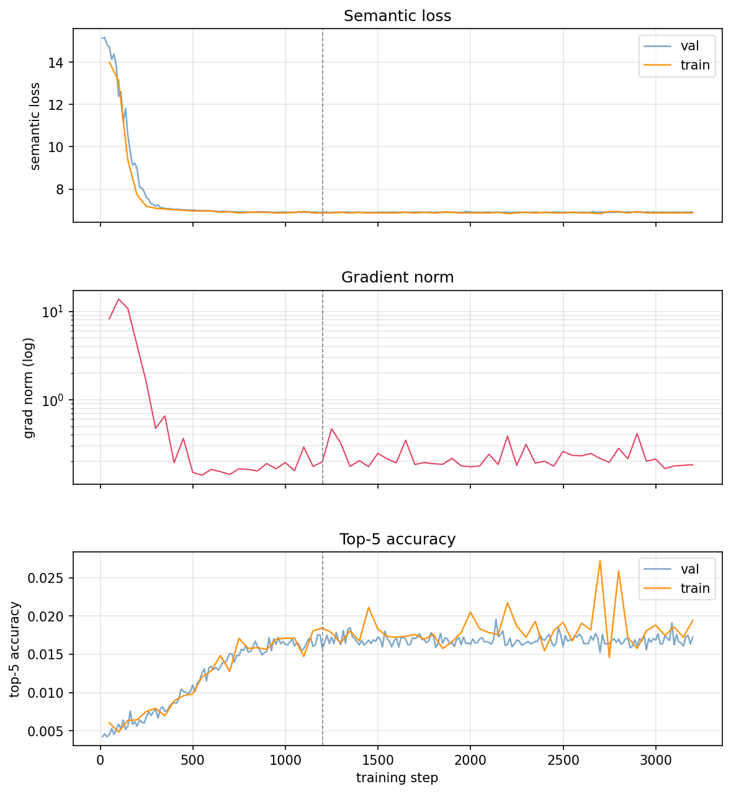

# Cloning an Italian voice with Fish-Speech S2-Pro and LoRA finetuning

*"Fermi tutti! Questo programma può contenere riferimenti espliciti e si rivolge ad un pubblico adulto. E non è adatto... ai minori!"*

**Step 1100** (~55 min of training on a single RTX 5090):

https://github.com/user-attachments/assets/210e2f4a-cfed-4d22-bc23-e794746d8196

**Step 2100:**

https://github.com/user-attachments/assets/1ebab48b-8119-4306-9f0c-cad6634ba8e5

---

## Introduction

The goal of this project is to fine-tune S2-Pro to reproduce a specific
Italian speaker — a public figure whose voice is instantly recognisable to
Italian audiences: a distinctive tenor, a measured academic cadence,
a characteristic rhythm of clause and pause. The `s2-pro` model already knows
Italian, although as a _tier 3_ language. What it does not know is *this*
Italian, with this voice.

We set out to refine the model through LoRA finetuning, which is supported
(almost) out of the box.

## Why not zero-shot with a reference audio?

Fish-Speech supports zero-shot voice cloning: provide a few seconds of
reference audio and a transcript, and the model will attempt to reproduce
that speaker's voice for any new text. This works reasonably well, but
it will contain minor artifacts.

The model captures
some surface features of the voice but keeps generic 
prosody and intonation. The speaker's characteristic rhythm, the
way they elongate certain vowels, the specific quality of his consonants:
these can be represented in the weights.

https://github.com/user-attachments/assets/88b5c10d-ef60-484e-9365-3641e421d6ad


## Improvements to the fine-tuning pipeline

Getting LoRA fine-tuning to work correctly on S2-Pro required several
fixes that are not in the upstream repository at the time of writing.

**`fix(deps): CUDA 12.9, updated wandb, protobuf override for RTX 5090`**
The RTX 5090 (Blackwell, sm_120) requires CUDA 12.9 and a matching
PyTorch build. The Dockerfile and `pyproject.toml` were updated
accordingly. Two additional dependency issues surfaced on this setup:
`wandb` needed a bump to `>=0.19.0`, and `descript-audiotools` pulls in
a `protobuf` version that conflicts with other dependencies — resolved
with a `uv` override pinning `protobuf>=3.20.0,<6.0.0`.

**`feat(lora): add `target_modules` with `fast_` prefix support`**
The original `setup_lora` function applied LoRA adapters to every linear
layer in the model unconditionally. We added a `target_modules` field to
`LoraConfig` that controls exactly which parts of the model receive
adapters. Valid values are `attention`, `mlp`, `embeddings`, `output` for
the slow transformer (and, for backwards compatibility, the fast
transformer too), and `fast_attention`, `fast_mlp`, `fast_embeddings`,
`fast_output` for the fast transformer only.

**`feat(callbacks): add `GradAccumProgressBar` and `AudioSampleCallback``**
`AudioSampleCallback` synthesises a sample audio file at each checkpoint during training, reusing the training
model in-place with no second copy loaded. Samples are saved alongside the checkpoints and logged to
TensorBoard, so you can listen to the voice evolve across training without
running a separate inference step.

## Dataset preparation

The training data consists of publicly available lecture recordings by the
target speaker. 55 recordings of approximately one hour each were manually
selected for quality and then processed through a four-stage pipeline.

### Prerequisites

Install the preprocessing dependencies:

```bash
uv sync --extra preprocess
```

You will also need:
- **ffmpeg** in your `PATH` (for audio conversion)
- A [Deepgram](https://deepgram.com/) API key (free tier is sufficient
  for a few hundred hours)
- Optionally, a [Google AI Studio](https://aistudio.google.com/) API key
  for Gemini transcript correction

### Stage 1 — Segmentation and transcription

Start with a folder of long audio files in any format ffmpeg can read
(MP3, MP4, M4A, FLAC, OGG, …). The preprocessing script at
`tools/preprocess/preprocess_audio.py` handles the full pipeline in a
single pass:

1. **Convert** — each file is converted to 24 kHz mono WAV via ffmpeg
   and cached in `_tmp_converted/` so the step is skipped on reruns.
2. **Diarize** *(optional, but strongly recommended)* — if a HuggingFace token is provided,
   pyannote 3.1 identifies the dominant speaker and discards all other
   segments (audience questions, applause, host intros). Nearby segments
   from the same speaker separated by less than 1.5 s are merged before
   the split step.
3. **Segment** — pydub silence detection splits each recording into
   chunks of 20–28 s. The algorithm looks for the latest silence gap
   within the preferred window; if none is found it falls back to the
   latest hard break (≥1.5 s silence) before 20 s; if still none it
   cuts hard at 28 s. Clips shorter than 3 s are discarded.
4. **Normalise** — each chunk is trimmed of leading/trailing silence,
   re-padded with 0.1 s on each side, and peak-normalised to −0.45 dBFS.
5. **Transcribe** — [Deepgram](https://deepgram.com/) nova-3 transcribes
   each chunk with 4 parallel workers and exponential-backoff retries.
   A `--keywords-file` (one term per line) can be passed to boost
   recognition of proper names or domain-specific vocabulary.
6. **Correct** *(optional, but strongly recommended)* — if a Google API key is provided, Gemini
   post-processes all transcripts for one audio file in a single
   context-aware call, correcting spelling and punctuation while
   preserving the keywords list. Batches of 30 chunks run in parallel.

With Gemini correction and a keywords file:

```bash
uv run python tools/preprocess/preprocess_audio.py \
    --input-dir /path/to/recordings \
    --output-dir data/raw/speaker \
    --deepgram-api-key $DEEPGRAM_API_KEY \
    --google-api-key $GOOGLE_API_KEY \
    --huggingface-token $HF_TOKEN \
    --keywords-file tools/preprocess/my_keywords.txt \
```

The script is resumable: converted and diarized WAVs are cached, and the
CSV is written only after all files complete. Output layout:

```
data/raw/speaker/
├── wavs/                   # normalised 20-28 s clips
│   ├── lecture01_0000.wav
│   ├── lecture01_0001.wav
│   └── ...
├── metadata.csv            # pipe-delimited, audio_file|text
├── debug.csv               # full audit trail with diarization detail
└── _tmp_converted/         # cached intermediates, safe to delete
```

### Stage 2 — Review and correct

Before committing the dataset it is worth spot-checking transcripts,
especially for proper names and domain-specific vocabulary that the ASR
may have mangled. The review server provides a browser interface for
this:

```bash
uv run python tools/preprocess/review_server.py \
    --output-dir data/raw/speaker
```

Open `http://localhost:8765` to play each clip alongside its raw and
Gemini-corrected transcript. Edits are saved to `corrections.csv`.
Entire source files can be masked from the dataset via `masked_sources.txt`, so
that it's easy to exclude low-quality samples.

### Stage 3 — Format conversion for Fish-Speech

Fish-Speech expects pairs of `.wav` and `.lab` (plain-text transcript)
files in a flat directory. The conversion script symlinks the audio
(avoiding duplication of large files) and writes each transcript as a
`.lab`:

```bash
uv run python tools/preprocess/prepare_dataset.py \
    --metadata data/raw/speaker/metadata.csv \
    --output-dir data/speaker
```

The script reads both `metadata.csv` and `corrections.csv` (if present),
with corrections taking precedence, and writes to `data/speaker/`.

### Stage 4 — VQ token extraction

The DAC codec tokenises each clip into discrete codes that the model
trains on.

```bash
uv run python tools/vqgan/extract_vq.py data/speaker \
    --num-workers 1 --batch-size 16 \
    --config-name modded_dac_vq \
    --checkpoint-path checkpoints/s2-pro/codec.pth
```

### Stage 5 — Protobuf sharding

The data loader consumes protobuf shards. All clips are packed into a
single group under `data/protos/`:

```bash
uv run python tools/llama/build_dataset.py \
    --input data/speaker --output data/protos \
    --text-extension .lab --num-workers 4
```

The resulting dataset contains **8,011 clips** with an average duration
of **24.8 seconds**, for a total of approximately **55 hours** of speech
from a single speaker. All clips land in a single proto group, which has
implications for how the data loader samples them — more on that in the
training section.

## Training

### Final configuration

The command that produced the best results:

```bash
EXP=speaker_$(date +%Y-%m-%dT%H%M%S)
mkdir -p results/${EXP}
PYTORCH_CUDA_ALLOC_CONF=expandable_segments:True \
uv run python fish_speech/train.py \
    --config-name text2semantic_finetune \
    project=${EXP} \
    +lora@model.model.lora_config=r_32_alpha_16_fast \
    trainer.max_steps=1200 \
    model.lr_scheduler.T_max=1200 \
    >> results/${EXP}/train.log 2>&1
cp fish_speech/configs/text2semantic_finetune.yaml results/${EXP}/
cp fish_speech/configs/lora/r_32_alpha_16_fast.yaml results/${EXP}/
```

The `PYTORCH_CUDA_ALLOC_CONF=expandable_segments:True` environment variable
is required to avoid fragmentation errors on the 32 GB RTX 5090 at
`max_length=4096`. The config files are copied into the results folder
immediately after launch for reproducibility — Hydra also writes a fully
resolved config to `results/${EXP}/.hydra/config.yaml`.

**LoRA config — `fish_speech/configs/lora/r_32_alpha_16_fast.yaml`:**

```yaml
_target_: fish_speech.models.text2semantic.lora.LoraConfig
r: 32
lora_alpha: 16
lora_dropout: 0.1
target_modules:
  - fast_attention
  - fast_mlp
  - fast_embeddings
  - fast_output
```

This targets only the fast transformer: 7.1 M trainable parameters out of
4.6 B total (0.15%). The slow transformer is completely frozen.

S2-Pro uses a Dual-AR architecture ([technical report](https://arxiv.org/abs/2603.08823))
built around two transformers in series:

The **Slow AR** is a Qwen3-4B backbone. It operates autoregressively over
the full token sequence — system prompt, target text, and discrete audio
tokens interleaved — and at each time step predicts the first RVQ codebook
token (the *semantic* token). Because this codebook is semantically
distilled during tokenizer training, the Slow AR is responsible for
linguistic content, prosody, and coarse acoustic structure. This is where
*language* lives.

The **Fast AR** is a lightweight 4-layer transformer with its own
independent weights and embedding tables. Given the semantic token produced
by the Slow AR at each step, it generates the remaining N−1 RVQ codebook
tokens depth-wise, conditioned on a linear projection of the Slow AR’s
hidden state. All codebook layers share a single embedding table within the
Fast AR, with codebook identity encoded via RoPE. This is where *voice
quality* and fine acoustic texture live.

The asymmetry is deliberate and important: a 4B-parameter model along the
time axis, a 4-layer network along the codebook depth axis. The Slow AR
does the heavy linguistic lifting; the Fast AR refines timbre efficiently.

For fine-tuning a specific speaker, this split is exactly what we want to
exploit: leave the Slow AR untouched (preserving the base model’s Italian
and its RL-trained behaviour), and adapt only the Fast AR to the target
voice.

**Key training hyperparameters:**

| Parameter | Value | Notes |
|---|---|---|
| `trainer.max_steps` | 1200 | Convergence is achieved already by ~500 |
| `trainer.accumulate_grad_batches` | 4 | Effective batch size 4 with `batch_size=1` |
| `trainer.precision` | bf16-true | Required for 32 GB VRAM headroom |
| `data.batch_size` | 1 | 4.6 B model at `max_length=4096` fills ~20 GB |
| `train_dataset.causal` | false | See below |
| `train_dataset.interactive_prob` | 1.0 | See below |
| `model.optimizer.lr` | 1e-5 | |
| `model.optimizer.weight_decay` | 0.01 | |
| `model.lr_scheduler` | CosineAnnealingLR | 1e-5 → 1e-6 over `T_max` steps |
| `callbacks.model_checkpoint.every_n_train_steps` | 100 | Output checkpoints and samples every 100 |

### Convergence

Training metrics for the final run (3200 steps, shown to
illustrate the plateau — 1200 is sufficient in practice). The dashed
vertical line marks the recommended 1200-step cutoff:



The gradient norm collapses to ~0.15 at step 500 and does not recover.
`val/semantic_loss` continues to improve slightly through step 1000
(7.01 → 6.91) before fully plateauing. Top-5 accuracy keeps climbing
slowly through 1000 steps (val: 0.0110 → 0.0163) before stalling. Steps 1000–3200 produced no
measurable improvement. **1200 steps is the recommended training budget**
for a dataset of this size (~55 h, single speaker), providing a small
margin past the plateau for robustness without meaningfully wasting
compute.

Note that `val/base_loss` — the slow transformer's contribution — barely
moves throughout training (10.58 → 10.57). This is expected: the slow
transformer is frozen, and confirms that the Italian language model
behaviour of s2-pro is fully preserved.

### What we tried that didn't work

**Training the slow transformer.** The `r_32_alpha_16_fast` config
deliberately freezes it. Using a full LoRA config (`r_32_alpha_32_all`
or the default with all four unprefixed `target_modules`) adds the slow
transformer's attention and MLP layers to the trainable set. In theory
this could improve prosody for a tier-3 language; in practice it risks
degrading the carefully RL-trained behaviour of the base model.
We observed that it was very easy for the slow model to converge to ending the
audio earlier and earlier as the training run goes on, or to anyway output
almost silent output, reducing the volume instead of making speech more
accurate.

**Different LoRA rank and alpha combinations.** We worked through several
configurations before settling on r=32, alpha=16, fast-only:

| Config | r | alpha | alpha/r | target_modules | Outcome |
|---|---|---|---|---|---|
| `r_32_alpha_184` | 32 | 184 | 5.75 | all (slow + fast) | Catastrophic — slow AR destroyed in 199 steps |
| `r_32_alpha_32_all` | 32 | 32 | 1.0 | all (slow + fast) | Slow AR degraded — see above |
| `r_32_alpha_32` | 32 | 32 | 1.0 | attention, mlp (slow + fast) | Same degradation, slower |
| `r_32_alpha_16` | 32 | 16 | 0.5 | all (slow + fast) | Minor slow AR degradation — usable, worth investigating further |
| `r_32_alpha_16_fast` | 32 | 16 | 0.5 | fast only | **Winner** |

The `alpha/r` ratio scales the magnitude of the LoRA updates (the weight
change is multiplied by `alpha/r` before being added to the frozen
weights). With alpha=184 and r=32 the ratio is 5.75 — nearly six times
larger than the next most aggressive configuration. The initial gradient
norm was 43.75 (versus ~8 at alpha=32), and `val/base_loss` collapsed
from 10.57 to 3.76 in just 199 steps: the slow transformer was
effectively destroyed in under four minutes of training. These early
runs also used the upstream default `lr=1e-4`; switching to `lr=1e-5`
with cosine decay — described below — further reduced the risk of
overshooting, but the alpha/r ratio was the dominant factor.

A ratio of 1.0 still produces enough drift to degrade the slow
transformer noticeably over longer runs. Halving it to 0.5 (`r_32_alpha_16`,
targeting all modules) showed only minor slow AR degradation and remained
usable — this configuration may be worth investigating further if
prosody improvements from the slow transformer are desired. Full
preservation of slow-transformer behaviour required also restricting
the target modules to the fast transformer entirely.

Rank 32 was briefly compared against r=8 and r=16 via short exploratory
runs; audio quality was judged better at r=32 in both cases, though this
was not investigated systematically. The fast transformer has 410M
parameters across 4 layers, so r=32 is still a small fraction of the
layer dimensions and is unlikely to be over-parameterised for this task.

**run more than ~1200 steps.** The
convergence curve is unambiguous: the model learns everything it can
by step 1000. Running 3200 steps consumed approximately four hours of
compute and produced no audible or measurable improvement over the
step-1200 checkpoint. Adjust `max_steps` (and `T_max` for the scheduler)
accordingly.

**`causal: true` with multi-session data.** The Fish-Speech
data loader has two sampling modes. With `causal: true` it picks a
random start index within a proto group and returns N *consecutive*
clips from that position. For a dataset built from 55 separate one-hour
recordings all packed into a single group, this means the model sees
dozens of clips from the same recording in sequence before moving to the
next one — training is uneven and the early sessions are
over-represented. With `causal: false` clips are drawn randomly from
across the entire group at each step, giving proper mixing.

**Do not expect `interactive_prob` to matter much.** We ran identical
experiments at `interactive_prob=1.0` (every sample presented as a
voice-cloning prompt with reference audio) and `interactive_prob=0.3`
(30% with reference, 70% without). Both runs converged to the same
`val/semantic_loss` of 6.90 within the same number of steps. The
perceptual difference in the generated audio was negligible.

**Using the upstream default optimizer settings for fine-tuning.**
The upstream config uses `lr=1e-4`, `weight_decay=0`, and a constant
schedule with warmup — appropriate for large-batch training from
scratch. For single-GPU fine-tuning with `batch_size=1` and
`accumulate_grad_batches=4`, a lower learning rate (`1e-5`) with cosine
decay to `1e-6` and mild weight decay (`0.01`) gives a much smoother
convergence curve and avoids the loss spike that appears in the early
steps at higher learning rates.

**`batch_size > 1` on a 32 GB card (RTX 5090) at `max_length=4096`.**
The 4.6 B parameter model in bf16 occupies roughly 9 GB of weights
alone. At `max_length=4096`, activations and KV cache during a forward
pass bring total VRAM usage to ~20 GB. A second sample in the batch
pushes this over 32 GB. Use `accumulate_grad_batches` to achieve a
larger effective batch size instead.

## Results

The fine-tuned model reproduces the target speaker's voice convincingly.
The characteristic tenor quality, the measured academic cadence, and the
specific rhythm of clause and pause are all present in the output. The
two samples linked at the top of this post — generated at step 1100 and
step 2100 respectively — illustrate that the voice is already well
captured within the first 1200 steps, with no perceptible difference
at step 2100.

The evaluation here is perceptual rather than formal: no MOS scores or
automatic speaker similarity metrics were computed. The intended use is
synthesis of new Italian text in the speaker's voice, and on that task
the model performs well. Occasional prosody errors remain — the model
sometimes misplaces emphasis on function words or clips a final syllable
— consistent with Italian being a tier-3 language in the base model.
These are artefacts of the Slow AR, which was deliberately left frozen.

## Conclusions

LoRA fine-tuning of Fish-Speech S2-Pro is an effective and efficient
route to speaker cloning. The key findings are:

- **Fast-only LoRA is sufficient and safe.** Adapting only the Fast AR
  (7.1 M of 4.6 B parameters) captures speaker-specific voice quality
  while leaving the Slow AR — and with it, the base model's Italian and
  its RL-trained behaviour — completely intact. Touching the Slow AR
  risks rapid degradation that is difficult to control.
- **The alpha/r ratio is the critical hyperparameter.** Values above 1.0
  cause measurable slow-transformer drift; the catastrophic failure at
  alpha=184 (ratio 5.75) destroyed the base model in under 200 steps.
  A ratio of 0.5 (r=32, alpha=16) proved conservative enough.
- **1200 steps is the right training budget** for a ~55-hour
  single-speaker dataset. Convergence is effectively complete by step
  500; the additional steps provide a small robustness margin at
  negligible cost.
- **The preprocessing pipeline matters.** Diarization, silence-aware
  segmentation, normalisation, and Gemini transcript correction each
  contribute to data quality. Clean 20–28 s clips with accurate
  transcripts are what the model trains on.

## Outlook

Several directions are worth pursuing from here.

**Alternative fine-tuning configurations.** The `r_32_alpha_16`
configuration (ratio 0.5, all modules including slow transformer) showed
only minor degradation and may be a productive middle ground — it could
improve prosody and intonation for tier-3 languages by allowing the Slow
AR to adapt slightly. A more targeted approach would be to restrict the
slow-transformer adapters to specific module types (e.g. attention only,
leaving MLP frozen) to give fine-grained control over how much the
linguistic model shifts. This space was not exhaustively explored here.

**Other languages and speakers.** The pipeline is language- and
speaker-agnostic. The preprocessing scripts, the LoRA configuration, and
the training recipe all generalise directly. Applying the same approach
to other tier-3 languages — or to speakers with less training data — is
a natural next step, and would help characterise how robust the method is
outside the conditions tested here.

**Upstream contributions.** Two pull requests are open against the
Fish-Speech repository: one adding `target_modules` with `fast_`-prefix
support to `LoraConfig`, and one contributing `AudioSampleCallback` for
in-training audio monitoring. If merged, these improvements will be
available to anyone using the upstream codebase without requiring the
patches described in this post.
